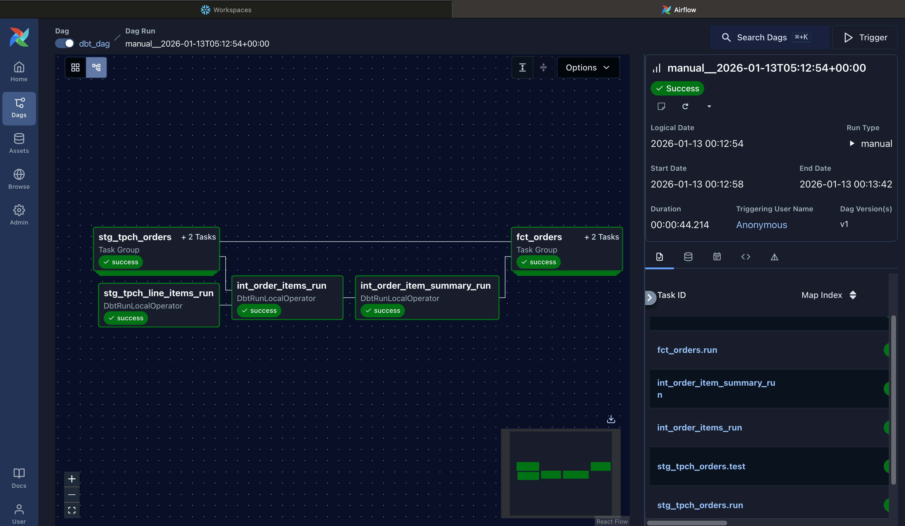
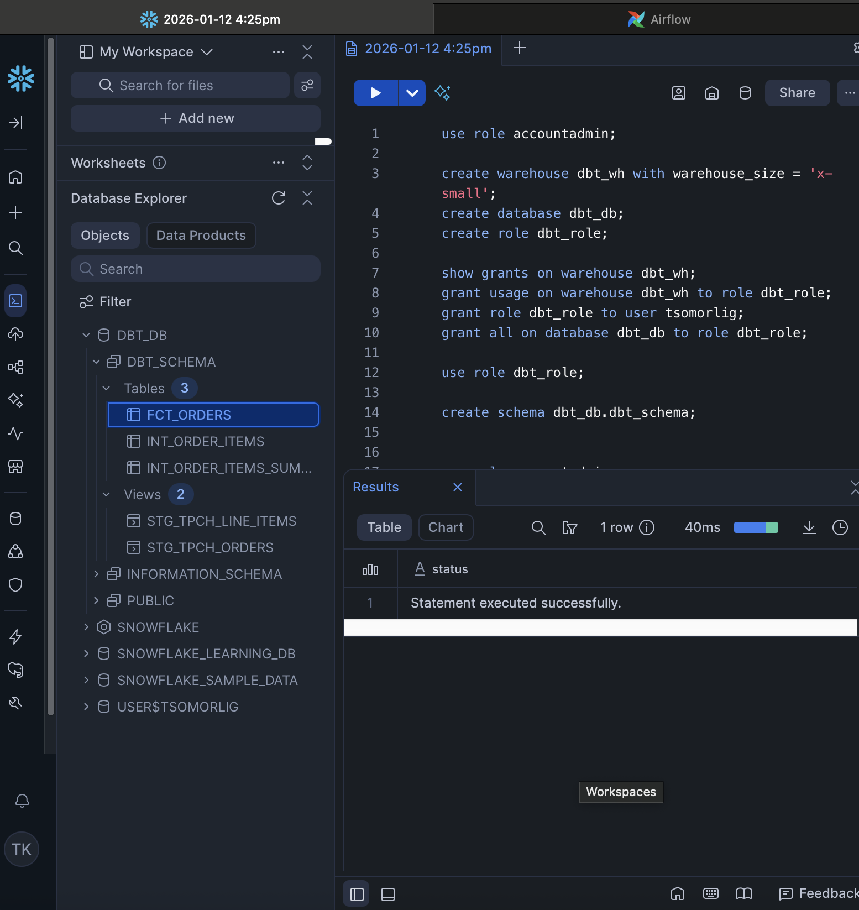

# Modern Data Stack ELT Pipeline: Snowflake, DBT, & Airflow




## Summary
This project implements a scalable **ELT (Extract, Load, Transform)** framework designed to handle complex transformations within a cloud data warehouse. By leveraging **Snowflake** for compute, **DBT** for modular transformation logic, and **Apache Airflow** for orchestration, the pipeline converts raw TPCH source data into analysis-ready dimensional models.

### Why ELT?
Unlike traditional ETL, this architecture leverages the massive parallel processing (MPP) power of **Snowflake** to transform data post-load. This reduces data movement, lowers latency, and allows for a "schema-on-write" approach that scales effectively with enterprise data volumes.

---

## Tech Stack & Core Concepts
* **Storage & Compute:** Snowflake (Data Warehousing)
* **Transformation Layer:** DBT Core (SQL-based modeling & Jinja templating)
* **Orchestration:** Apache Airflow / Astronomer Cosmos (DAG scheduling)
* **Data Modeling:** Star Schema (Fact and Dimension tables)
* **Quality Assurance:** Automated Schema & Data Integrity Testing

---

## Engineering Workflow

### 1. Warehouse Architecture & Security
The foundation was built using specialized Snowflake objects to ensure resource isolation and security:
* **Compute:** Dedicated `DBT_WH` to isolate transformation workloads from analytical queries.
* **RBAC:** Implemented Role-Based Access Control (`DBT_ROLE`) to follow the principle of least privilege.

### 2. Modular Data Modeling (DBT)
I organized the transformation layer into a multi-stage architecture:
* **Staging Layer:** Cleaning and casting raw TPCH data into standardized views.
* **Intermediate/Marts:** Building the core business logic.
    * **Fact Tables:** Designed around business processes (orders/line items).
    * **Surrogate Keys:** Implemented via DBT hashes to handle composite keys for dimensional integrity.
* **Macros:** Developed reusable Jinja macros for DRY (Don't Repeat Yourself) coding, such as standardized financial calculations.

### 3. Data Quality & Observability
To ensure data reliability, I implemented a robust testing suite:
* **Generic Tests:** Enforcing `unique` and `not_null` constraints on primary keys.
* **Singular Tests:** Custom SQL assertions to validate business logic (e.g., ensuring shipping dates never precede order dates).

### 4. Production Orchestration (Airflow)
Using **Astronomer Cosmos**, I integrated the DBT project directly into **Airflow DAGs**. This allows for:
* **Task Atomicity:** Mapping DBT models to individual Airflow tasks for granular failure recovery.
* **Scheduling:** Automated daily refreshes with built-in retry logic.
* **Containerization:** The environment is fully Dockerized for consistent deployment across environments.

---

## Project Structure
```text
data_pipeline/
├── dags/               # Airflow DAG definitions & Cosmos integration
├── models/
│   ├── staging/        # Source alignment & cleaning
│   └── marts/          # Fact & Dimension tables (Star Schema)
├── macros/             # Reusable Jinja logic
├── tests/              # Data quality assertions
└── Dockerfile          # Containerized environment setup


